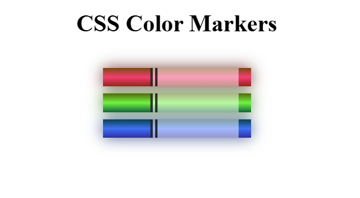

# 🎨 Color Markers

This is a simple web project that showcases multiple colored markers using basic HTML and CSS.

## 📌 Description

Each color box is styled with a different `background-color` using various CSS color formats such as:

- HEX (`#4D567E`)
- RGB (`rgb(223,56,74)`)
- HSL (`hsl(120,35%,52%)`)
- Named color (`aqua`, `brown`)

The boxes are displayed horizontally in the center with spacing between them.

## 🖼️ Preview

## 🗂️ Project Structure

color-markers/

├── index.html

├── styles.css

├── preview.png

└── README.md

## 🛠️ Built With

- HTML
- CSS

## ✅ Features

- Simple layout with color boxes
- Centered and evenly spaced boxes
- Demonstrates multiple color value types

